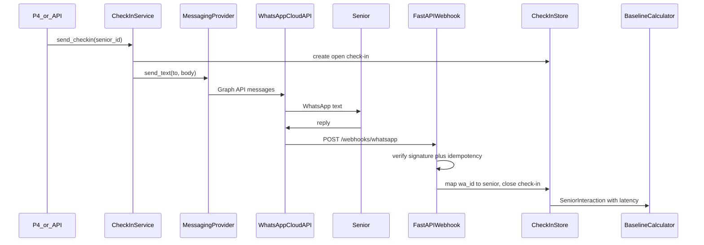

# P3 — WhatsApp Integration + Check-In Pipeline — Design

- **Status:** approved for planning
- **Date:** 2026-09-01
- **Owner:** P3
- **Branch:** `feat/P3`
- **Brief:** [p3-whatsapp-integration.md](../../p3-whatsapp-integration.md)
- **Implementation plan:** [../plans/2026-09-01-whatsapp-checkin-implementation-plan.md](../plans/2026-09-01-whatsapp-checkin-implementation-plan.md)
- **Meta setup:** [../meta-cloud-api-setup.md](../meta-cloud-api-setup.md)

## 1. Purpose

Connect Nomi to the **official WhatsApp Business Platform / Cloud API** and
own the messaging plumbing that turns a real WhatsApp round trip into a
`SeniorInteraction` the baseline and detection layers already understand.

P3 proves this path:

**Nomi/FastAPI → actual WhatsApp → senior reply → Meta webhook → FastAPI →
interaction stored / baseline updated**

Nomi does not diagnose, predict medical conditions, assign danger labels, or
emit a numeric risk score. P3 is transport + check-in bookkeeping. P4 decides
*when* to verify or escalate; P3 only sends what it is asked to send.

## 2. Scope

### In scope

- Meta webhook verification (`GET`).
- Inbound WhatsApp message webhook handling (`POST`), including signature
  checks and idempotency.
- Outbound text messaging through a provider abstraction.
- Map WhatsApp sender identifiers (`wa_id` / phone) to Nomi seniors.
- Store check-ins with timestamps and Meta message IDs.
- Map a senior reply onto `SeniorInteraction` so
  `response_latency_minutes` and optional wellbeing can feed
  `BaselineCalculator`.
- Basic on-demand check-in send path for the MVP (no scheduler).
- Messaging helpers P4 needs for verification prompts and caregiver alerts.
- Environment-variable credentials and a `.env.example` with placeholders.
- Tests with external Meta calls mocked.
- Documented Meta Cloud API setup for the team.
- A mock provider so the MVP remains demonstrable if Meta blocks live use.

### Out of scope

- Verification / escalation decision logic (P4).
- Frontend / caregiver dashboard (P5).
- Public HTTPS deployment, CORS, and webhook URL hosting (P6).
- WhatsApp Web scraping or unofficial personal-account automation.
- Storing free-text message bodies on baseline tables.
- Medical diagnosis, clinical prediction, emergency certainty, or a generic
  numeric risk/concern score.
- Scheduled / cron check-ins. MVP send is on-demand via API + service call.
- Rewriting `BaselineCalculator`, P1/P2 detectors, or frontend payload shapes.
- Altering the existing `senior_interactions.senior_id uuid` migration.

### Blast radius

Additive. New packages under `nomi_backend.messaging` and
`nomi_backend.checkins`. New webhook and check-in routes in
`apps/backend/src/nomi_backend/api/app.py`. `httpx` added to
`apps/backend/pyproject.toml`. New migration
`infra/supabase/migrations/202609010001_whatsapp_checkin_pipeline.sql`.
Root `.env.example` with placeholders only.

Do **not** modify `baseline/calculator.py`, `detection/**`,
`services/demo_repository.py` payload shapes, the frontend, or
`infra/supabase/migrations/202608300001_baseline_layer.sql`.

## 3. Place in the Nomi workflow

Nomi's operational pipeline is **LEARN → NOTICE → VERIFY → SUPPORT**.

| Stage | Owner | P3 role |
|---|---|---|
| LEARN | Baseline layer | Persist check-in observations as `SeniorInteraction` |
| NOTICE | P1 / P2 | No detection logic; replies become history those layers already read |
| VERIFY | P4 | Provide `send_verification_prompt` / `send_text` |
| SUPPORT | P4 | Provide `send_caregiver_alert` / `send_text` |

Tech stack this workstream uses, matching
[supporting-architecture.md](../../../architecture/supporting-architecture.md):

- **Messaging:** official WhatsApp Cloud API (Graph API), never unofficial clients.
- **Backend:** FastAPI + Python 3.11+.
- **Database:** Supabase PostgreSQL for contacts, check-ins, and event idempotency.
- **HTTP client:** `httpx` for Graph API calls.
- **Dashboard / deploy:** out of scope (P5 / P6). P6 hosts the public HTTPS
  webhook URL this design assumes.



## 4. Foundation reused

The baseline layer already provides the observation contract P3 must emit:

- `SeniorInteraction` — `senior_id: str`, `occurred_at`, `interaction_type`,
  `missed_checkin`, `checkin_sent_at`, `response_received_at`,
  `wellbeing_score`, `checkin_id`, `source="nomi"`, and derived
  `response_latency_minutes`.
- `BaselineCalculator.calculate(senior_id, interactions)` — filters
  `source == "nomi"`.
- Demo `interaction_type` values: `"checkin_response"` and `"checkin_missed"`.

Privacy rule from [baseline-layer.md](../../../architecture/baseline-layer.md):
keep message bodies and free-text content **out** of `senior_interactions`.
P3 may inspect a reply body in memory to parse an optional `1`–`5`
wellbeing score, then drop the text.

## 5. Package layout (all new files unless noted)

```
apps/backend/src/nomi_backend/
├── messaging/
│   ├── __init__.py          # public exports
│   ├── protocol.py          # Recipient, OutboundMessage, MessagingProvider
│   ├── settings.py          # MessagingSettings from environment
│   ├── mock_provider.py     # in-memory provider
│   └── whatsapp_cloud.py    # Meta Graph API implementation
├── checkins/
│   ├── __init__.py
│   ├── models.py            # CheckIn, CheckInStatus, SeniorContact, ContactRole
│   ├── store.py             # CheckInStore protocol + InMemoryCheckInStore
│   ├── wellbeing.py         # optional 1–5 parse; never stores body
│   └── pipeline.py          # CheckInService orchestration
└── api/app.py               # MODIFY: webhook + POST /api/v1/checkins

apps/backend/tests/
├── test_messaging_settings.py
├── test_messaging_protocol.py
├── test_mock_provider.py
├── test_whatsapp_cloud.py
├── test_checkin_store.py
├── test_checkin_pipeline.py
└── test_whatsapp_webhook.py

infra/supabase/migrations/
└── 202609010001_whatsapp_checkin_pipeline.sql

.env.example                 # repo root; placeholders only
docs/workstreams/P3/
├── specs/2026-09-01-whatsapp-checkin-design.md   # this document
├── plans/2026-09-01-whatsapp-checkin-implementation-plan.md
└── meta-cloud-api-setup.md
```

## 6. Messaging provider (`messaging/protocol.py`)

Core Nomi logic must not import Meta types, tokens, or Graph URLs. All
outbound traffic goes through `MessagingProvider`.

```python
class ContactRole(str, Enum):
    SENIOR = "senior"
    CAREGIVER = "caregiver"

@dataclass(frozen=True)
class Recipient:
    senior_id: str | None     # Nomi id when known; None for caregiver-only sends
    wa_id: str                # WhatsApp sender id / digits
    role: ContactRole

@dataclass(frozen=True)
class OutboundMessage:
    provider_message_id: str  # Meta wamid, or mock id
    recipient: Recipient
    sent_at: datetime
    correlation_id: str | None

class MessagingError(Exception):
    """Raised when the provider cannot send. Never includes secrets."""

class MessagingProvider(Protocol):
    def send_text(
        self,
        recipient: Recipient,
        body: str,
        *,
        correlation_id: str | None = None,
    ) -> OutboundMessage: ...
```

### Implementations

| Class | Behaviour |
|---|---|
| `WhatsAppCloudProvider` | `POST https://graph.facebook.com/{version}/{phone_number_id}/messages` with `Authorization: Bearer <token>`. JSON body is the official Cloud API text payload. Returns `OutboundMessage` from `messages[0].id`. |
| `MockMessagingProvider` | Records sends in memory, returns deterministic `mock-wamid-{n}` ids. Used in unit tests and when `NOMI_MESSAGING_PROVIDER=mock`. |

Factory: `build_messaging_provider(settings: MessagingSettings) -> MessagingProvider`
selects `whatsapp` or `mock` from `settings.provider`. Unknown values raise
`ValueError`.

### P4 surface

P4 owns copy and timing. P3 exposes thin helpers that resolve a contact and
call `send_text`. They do **not** decide whether verification or escalation
should happen.

```python
def send_verification_prompt(
    service: CheckInService, senior_id: str, body: str
) -> OutboundMessage: ...

def send_caregiver_alert(
    service: CheckInService, caregiver_senior_id: str, body: str
) -> OutboundMessage: ...
```

`caregiver_senior_id` is the Nomi senior whose caregiver should be alerted.
The store looks up the contact with `role=caregiver` for that senior. If
none exists, raise a domain error (`ContactNotFound`), not a Meta error.

## 7. Settings

All credentials come from the environment. Never hard-code tokens, phone
numbers, app secrets, or IDs.

```python
@dataclass(frozen=True)
class MessagingSettings:
    provider: str                    # "whatsapp" | "mock"
    access_token: str
    phone_number_id: str
    verify_token: str
    app_secret: str
    graph_api_version: str           # default "v21.0"
    default_checkin_body: str        # MVP copy; overridable by caller
```

`MessagingSettings.from_env()` reads:

| Variable | Required when | Notes |
|---|---|---|
| `NOMI_MESSAGING_PROVIDER` | always | `whatsapp` or `mock`; default `mock` so local tests run without Meta |
| `WHATSAPP_ACCESS_TOKEN` | provider=`whatsapp` | Graph API bearer token |
| `WHATSAPP_PHONE_NUMBER_ID` | provider=`whatsapp` | Cloud API phone-number id |
| `WHATSAPP_VERIFY_TOKEN` | webhook GET | shared secret P6 configures in Meta |
| `WHATSAPP_APP_SECRET` | webhook POST | HMAC for `X-Hub-Signature-256` |
| `WHATSAPP_GRAPH_API_VERSION` | optional | default `v21.0` |
| `NOMI_CHECKIN_BODY` | optional | default gentle check-in copy |

`.env.example` lists every key with empty or obviously fake placeholders.
`from_env()` must never log secret values.

## 8. Identity and check-in records

### Why new tables

The existing `senior_interactions.senior_id` column is `uuid`. Demo seniors
and the FastAPI/frontend contract use string ids (`senior-1`). That
migration is already the baseline-layer contract and **must not be edited**.
P3 tables use `text` `senior_id` matching the Python model. P6 coordinates
any later unification.

P3 does **not** write to `public.senior_interactions` in this workstream.
It produces `SeniorInteraction` objects in the check-in store so
`BaselineCalculator` can be called with `store.interactions_for(senior_id)`.
Persisting those rows into the uuid table is a P6 integration item.

### `senior_contacts`

| Column | Type | Notes |
|---|---|---|
| `id` | uuid PK | |
| `senior_id` | text NOT NULL | Nomi senior id (`senior-1`) |
| `wa_id` | text NOT NULL | WhatsApp id from webhook `from` / `contacts[].wa_id` |
| `phone_e164` | text NULL | optional display / send target |
| `role` | text NOT NULL | `senior` or `caregiver` |
| `created_at` | timestamptz | |

Unique `(wa_id)`. Unique `(senior_id, role)` so one senior WhatsApp and one
caregiver WhatsApp per senior for the MVP.

Unknown inbound `wa_id` values: return HTTP 200 and ignore. Do not create
seniors from inbound chat (privacy: only opted-in Nomi conversations).

### `nomi_checkins`

| Column | Type | Notes |
|---|---|---|
| `id` | text PK | UUID string; becomes `SeniorInteraction.checkin_id` |
| `senior_id` | text NOT NULL | |
| `sent_at` | timestamptz NOT NULL | |
| `outbound_wamid` | text NULL | Meta id of the outbound check-in |
| `status` | text NOT NULL | `sent` \| `responded` \| `missed` |
| `response_wamid` | text NULL | Meta id of the senior reply |
| `response_received_at` | timestamptz NULL | |
| `wellbeing_score` | double precision NULL | only when reply parsed as 1–5 |
| `created_at` | timestamptz | |

### `whatsapp_events`

| Column | Type | Notes |
|---|---|---|
| `inbound_wamid` | text PK | Meta message id |
| `wa_id` | text NOT NULL | |
| `received_at` | timestamptz NOT NULL | |
| `checkin_id` | text NULL | set when the event closed a check-in |
| `ignored_reason` | text NULL | e.g. `unknown_sender`, `status_update`, `duplicate` |

Unique `inbound_wamid` is the idempotency key. Duplicate Meta deliveries
insert nothing and return 200.

### In-memory store for tests and mock mode

`InMemoryCheckInStore` implements the same `CheckInStore` protocol the SQL
adapter will later match. Implementation and tests target the in-memory
store first so P3 is demonstrable without a live Supabase. The migration
is committed so P6 can apply it.

```python
class CheckInStore(Protocol):
    def get_contact_by_wa_id(self, wa_id: str) -> SeniorContact | None: ...
    def get_contact(self, senior_id: str, role: ContactRole) -> SeniorContact | None: ...
    def upsert_contact(self, contact: SeniorContact) -> SeniorContact: ...
    def create_checkin(self, checkin: CheckIn) -> CheckIn: ...
    def get_open_checkin(self, senior_id: str) -> CheckIn | None: ...
    def save_checkin(self, checkin: CheckIn) -> CheckIn: ...
    def record_inbound_event(self, event: WhatsAppEvent) -> bool:
        """Return False if inbound_wamid already seen (duplicate)."""
    def interactions_for(self, senior_id: str) -> list[SeniorInteraction]: ...
```

`interactions_for` maps closed/missed check-ins to `SeniorInteraction`
records (`source="nomi"`). Open (`sent`) check-ins are not yet
observations.

## 9. Check-in pipeline (`checkins/pipeline.py`)

```python
class CheckInService:
    def send_checkin(
        self, senior_id: str, *, body: str | None = None
    ) -> CheckIn: ...

    def handle_inbound_message(
        self, *, wa_id: str, wamid: str, received_at: datetime, text: str | None
    ) -> SeniorInteraction | None: ...

    def mark_missed(self, checkin_id: str, *, as_of: datetime) -> SeniorInteraction: ...
```

### Outbound `send_checkin`

1. Resolve `Recipient` via `store.get_contact(senior_id, SENIOR)`. Missing
   contact → `ContactNotFound`.
2. If an open check-in already exists for that senior, do not send another;
   return the existing open row (MVP: one in-flight check-in per senior).
3. Create `CheckIn(status=sent, sent_at=now)`.
4. `provider.send_text(recipient, body or settings.default_checkin_body,
   correlation_id=checkin.id)`.
5. Store `outbound_wamid` from `OutboundMessage.provider_message_id`.
6. Return the check-in.

Default MVP body (not a medical question):

> Hi, this is Nomi checking in. How are you today? Reply with a number from 1 (low) to 5 (good), or any short reply so we know you saw this.

### Inbound `handle_inbound_message`

1. `record_inbound_event` — if duplicate `wamid`, return `None`.
2. Lookup `wa_id`. Unknown sender → record `ignored_reason=unknown_sender`,
   return `None`.
3. Ignore non-senior roles (caregiver replies are not check-in observations).
4. Find the latest open check-in for that senior. If none, record
   `ignored_reason=no_open_checkin` and return `None` (unsolicited messages
   are not Nomi interactions).
5. Close it: `status=responded`, `response_wamid`, `response_received_at`.
6. Parse wellbeing with `parse_wellbeing_score(text)` — a stripped body that
   is exactly `1`, `2`, `3`, `4`, or `5` (optional surrounding whitespace).
   Any other text → `wellbeing_score=None`. **Do not store `text`.**
7. Return the new `SeniorInteraction`:
   - `interaction_type="checkin_response"`
   - `missed_checkin=False`
   - `checkin_sent_at` from the check-in
   - `response_received_at` from the webhook timestamp
   - `occurred_at=response_received_at`
   - `checkin_id` set
   - `source="nomi"`

### `mark_missed`

P4/P6 call this when a check-in times out. Sets `status=missed` and emits
`SeniorInteraction(interaction_type="checkin_missed", missed_checkin=True,
checkin_sent_at=..., response_received_at=None, wellbeing_score=None)`.

P3 does not run a timer.

## 10. Webhook HTTP API

Public Meta callback path — **not** under `/api/v1`, so P6 can point Meta at
`https://<host>/webhooks/whatsapp`.

### `GET /webhooks/whatsapp`

Query params: `hub.mode`, `hub.verify_token`, `hub.challenge`.

- If `hub.mode == "subscribe"` and `hub.verify_token` matches
  `WHATSAPP_VERIFY_TOKEN`, return `hub.challenge` as `text/plain` with 200.
- Otherwise 403.

### `POST /webhooks/whatsapp`

1. Read raw body. Verify `X-Hub-Signature-256` = `sha256=` + hex HMAC-SHA256
   of the raw body with `WHATSAPP_APP_SECRET`. Mismatch → 403. Missing
   header when `app_secret` is configured → 403.
2. Parse JSON. Ignore payloads that are not `object == whatsapp_business_account`.
3. Walk `entry[].changes[].value`. Process `messages[]` text items. Ignore
   `statuses[]` (delivery receipts) without creating interactions.
4. For each text message call `handle_inbound_message`.
5. Always return 200 JSON `{"ok": true}` after a valid signature, even when
   every message was ignored. Meta retries on non-2xx.

### `POST /api/v1/checkins`

MVP demo trigger. JSON `{"senior_id": "senior-1"}`. Optional `{"body": "..."}`.

- 201 with the check-in as primitives (`id`, `senior_id`, `status`,
  `sent_at`, `outbound_wamid`).
- 404 if the senior contact is unknown.
- 503 if the provider raises `MessagingError`.

Does not replace P4's service-layer calls; it exists so the team can prove
the round trip without a scheduler.

## 11. Error and edge handling

| Case | Behaviour |
|---|---|
| Duplicate Meta `wamid` | 200, no second interaction |
| Unknown `wa_id` | 200, ignore |
| Status/delivery webhook | 200, ignore |
| Non-text message (image, voice, reaction) | 200, ignore (`ignored_reason=unsupported_type`) |
| Reply with no open check-in | 200, ignore |
| Caregiver `wa_id` inbound | 200, ignore (not a senior observation) |
| Invalid signature | 403 |
| Provider send failure | `MessagingError`; HTTP 503 on the check-in route; no `sent` check-in left dangling — create the row only after a successful send, or mark it failed and do not treat it as open |
| Missing env when provider=`whatsapp` | fail at settings load, not at first request, with a clear error naming the variable (not the value) |
| Wellbeing parse miss | interaction still stored; `wellbeing_score=None` |
| Mock provider selected | no network; round trip via in-memory send + test/helper inject of inbound |

Send-then-record: persist `status=sent` only after `send_text` succeeds, so
a Graph API failure does not leave an open check-in that swallows a later
real reply.

## 12. Testing

`unittest`, matching `apps/backend/tests/test_baseline.py` (path shim, no
pytest). Meta HTTP is mocked with `unittest.mock`; no live Graph calls.

| File | Covers |
|---|---|
| `test_messaging_settings.py` | env load, defaults, missing required vars, never reads real secrets from disk |
| `test_messaging_protocol.py` | dataclass frozen fields; `ContactRole` values |
| `test_mock_provider.py` | send records, incremental ids, correlation_id round-trip |
| `test_whatsapp_cloud.py` | request URL/headers/JSON; maps Graph `messages[0].id`; raises `MessagingError` on 4xx |
| `test_checkin_store.py` | contact lookup, open-checkin uniqueness, event idempotency, `interactions_for` |
| `test_checkin_pipeline.py` | send → reply latency, wellbeing parse, unknown sender, duplicate wamid, mark_missed, one in-flight check-in |
| `test_whatsapp_webhook.py` | GET challenge success/fail; POST signature; duplicate delivery; status-only payload |

## 13. Coordination notes

- **P4** — consume `CheckInService.send_checkin`, `send_verification_prompt`,
  `send_caregiver_alert`, and `mark_missed`. P4 owns timeouts and copy.
  Do not put escalation rules in P3.
- **P5** — no frontend changes. Existing GET senior payloads stay on
  `DemoBaselineRepository` until P6 wires live interactions.
- **P6** — public HTTPS URL for `/webhooks/whatsapp`; env vars in deploy;
  apply `202609010001_whatsapp_checkin_pipeline.sql`; decide when to replace
  demo data with `store.interactions_for`; unify `senior_id` text vs uuid.
- **Team** — `pyproject.toml` gains `httpx`. Coordinate before anyone writes
  to the original `senior_interactions` uuid table from this pipeline.

## 14. Open questions

- Default check-in copy may be revised with P4/P5 for the live demo; the
  setting `NOMI_CHECKIN_BODY` exists so copy is not code.
- Whether P6 persists P3 `SeniorInteraction` objects into
  `public.senior_interactions` or keeps a parallel store. P3 documents the
  mapping and does not migrate uuid columns.
- Graph API version pin (`v21.0`) should be bumped only with a team check;
  it is an env default, not a hardcoded client path beyond that default.

## 15. Finish-line documentation (after implementation)

When code lands, add a short implementation note in this folder covering:

- files changed
- API routes added
- schema / migration
- environment variables
- assumptions
- tests
- how P4 and P6 integrate

That note is written at implementation time, not in this planning pass.
